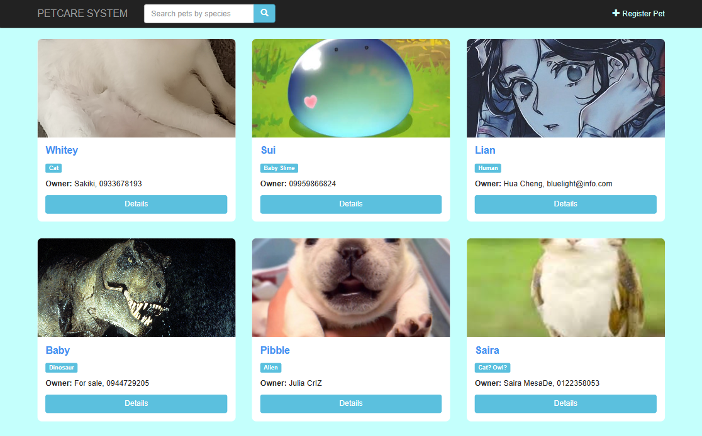

# PetCare System

Welcome to the **PetCare System**, a simple and intuitive web application designed to manage and track pet profiles. 

*This project is a PHP laboratory requirement for my Application Development course.*

## Features

- **Dashboard:** A clean and responsive dashboard to view all registered pets in a grid layout.
- **Search Functionality:** Easily search and filter pets by species.
- **Register Pet:** Add new pet profiles to the system with their details and an image upload.
- **Pet Profiles:** View a detailed layout for individual pets (Species, Age, Owner Contact, Description, and photo).
- **Edit Records:** Update existing pet information as needed.
- **Delete Records:** Delete a pet's profile securely from the database.

## Tech Stack

This project is built using the following technologies:

- **Frontend:**
  - HTML5 & CSS3
  - Bootstrap v3.3.7 (CSS Framework for responsive layouts)

- **Backend:**
  - PHP (Server-side logic)

- **Database:**
  - MySQL with PDO (PHP Data Objects)

## UI Screeshot

*Bai Sakina Abad*
*3BSCS1*
*April 2026*
